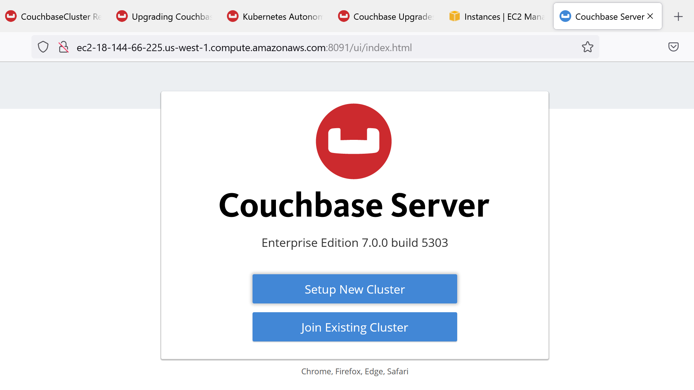

# 설치 사전 준비

### PuTTY 설치 및 첫 번째 VM 연결 (Windows 사용하실 경우만 해당)


\*참고: Mac을 사용 중이라면, 아래의 “Terminal/iTerm2를 통한 첫 번째 VM 연결 (Mac 전용)” 부분으로 이동하세요.\
Amazon VM에 연결/SSH 하기 위해 기본 제공되는 Terminal 또는 iTerm2(기본 Terminal을 대체하는 더 많은 기능을 제공하는 앱)를 사용할 수 있으므로, Windows 전용 앱인 PuTTY는 필요하지 않습니다.


Windows를 사용 중이라면 무료 텔넷/SSH 클라이언트인 PuTTY 설치를 강력히 권장합니다.\
PuTTY를 사용하면 Windows에서 가벼운 클라이언트를 통해 Amazon VM에 접속할 수 있으며, 동일한 VM에 여러 개의 명령줄 세션을 열 수 있습니다.

PuTTY 다운로드 링크: https://www.chiark.greenend.org.uk/\~sgtatham/putty/latest.html

`Windows (Intel x86)` 항목에서 `putty.exe`라는 이름의 파일을 찾으세요.

<figure><figcaption></figcaption></figure>

PuTTY는 별도의 설치 과정이 필요하지 않습니다. 다운로드한 .exe 파일을 바로 실행하면 됩니다.

PuTTY를 실행한 후, `첫 번째 Amazon VM`의 공용 IP 주소를 PuTTY에 입력하세요. 이 IP 주소는 본 실습과 함께 강사가 제공한 Cluster-IPs 스프레드시트에서 확인할 수 있습니다. 연결 유형은 SSH, 포트는 22로 설정합니다.

강사가 제공한 `첫 번째 Amazon VM`의 공용 호스트 이름을 PuTTY에 입력한 뒤, SSH 항목 옆의 + 기호를 클릭하여 옵션을 확장하고, 마지막으로 Auth를 선택하세요.

<figure><figcaption></figcaption></figure>

인증을 위해 개인 키 파일(Private key file) 을 선택하려면 `Browse`를 클릭하세요.\

<figure><figcaption></figcaption></figure>

강사가 제공한 “Amazon-Private-Key.ppk” 파일을 선택하세요.

왼쪽 창에서 Colors를 클릭한 후, Select a Colour to adjust에서 Default Background를 선택하고 Blue RGB 값을 90으로 변경하세요.

<figure><figcaption></figcaption></figure>

다음으로, Session을 클릭하고 세션 이름을 `CouchbaseXX`로 입력하여 저장하세요. 여기서 `XX`는 호스트명에서 가져온 노드 번호입니다. 그런 다음 Save를 클릭합니다.\
예를 들어, 여기서는 세션이 `Couchbase01`로 저장되고 있습니다:

<figure><figcaption></figcaption></figure>

이제 `Couchbase01`을 선택(하이라이트)하고 Open을 클릭하여 이 VM에 연결합니다:

<figure><figcaption></figcaption></figure>

성공적으로 연결하기 전에 서버의 rsa2 키에 대한 메시지가 나타나면 `Yes`를 클릭해야 합니다.

<figure><figcaption></figcaption></figure>

\
로그인에 사용할 사용자 이름은 다음과 같습니다:

Login as: ec2-user

<figure><figcaption></figcaption></figure>

