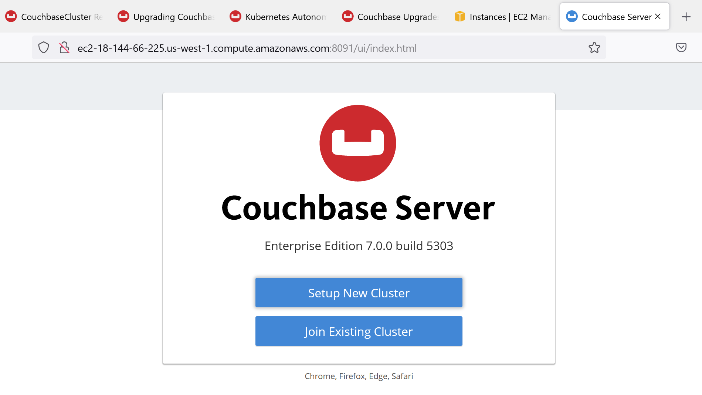

# 1.3 단일 노드 Couchbase 클러스터 구성


설치 출력 예시에 제공된 URL은 바로 동작하지 않는다는 점에 유의하세요.

위 설치 출력에서 나온 AWS 내부 호스트네임 또는 Couchbase01(예: ip-172-31-33-xx)을 강사님으로 부터 제공받은 VM의 퍼블릭 호스트네임(예: ec2-54-88-123-x.compute-1.amazonaws.com)으로 교체해야 합니다.



Chrome 또는 Firefox 브라우저를 열고 다음 URL로 이동하세요:

```
http://<public hostname of your VM>:8091
```

<figure><figcaption></figcaption></figure>


하단 영역에 있는 Setup New Cluster 버튼을 클릭하여 계속 진행하세요.

Cluster Name을 One Node Cluster로 입력하고, Administrator 비밀번호는 couchbase로 설정하세요.


⚠️ 강사님의 안내가 있을 때까지, 이 로그인과 비밀번호에서 벗어나지 마세요.

만약 다른 비밀번호를 사용하면, 강사가 귀하의 비밀번호를 알 수 없기 때문에 수업 후에는 문제 해결이 불가능하며, 학생들의 문제 해결 시간이 훨씬 더 길어질 수 있습니다!


<figure><figcaption></figcaption></figure>

이 지침에 나온 Administrator 이름과 비밀번호를 변경하지 마세요!

`Next Accept Terms` 를 클릭합니다.


약관 동의(Check the accept terms & conditions) 박스를 선택하세요.

<figure><figcaption></figcaption></figure>

\


`Configure Disk, Memory, Services` 를 클릭합니다.


“Couchbase > New Cluster > Configure” 페이지의 일부 설정을 변경해야 합니다. 특히 회색으로 표시된 항목들을 수정해야 합니다:

* Hostname: \<VM의 Public hostname>을 입력하세요. (Cluster-IPs 스프레드시트에서 확인하거나 브라우저 URL 입력창에서 가져올 수 있습니다. 예: \<ec2-UU-XXX-YY-ZZZ.compute-1.amazonaws.com>).
* Node-to-node encryption 활성화 체크박스를 선택하세요.
* 아래 Services 항목들을 선택하세요:
  * Data
  * Index
  * Query
* 나머지 서비스 항목의 체크박스는 모두 해제하세요.

***

서비스 메모리 할당 (Service Memory Quotas, 서비스/노드별, MiB 단위):

* DATA RAM Quota: 2024 MB
* Index RAM Quota: 512 MB (오른쪽에 최소 RAM 값 표시됨)
  * 메모리 값이 다르게 표시되거나, 더 많은 RAM이 사용 가능한 전용 INDEX 서비스를 구성하는 경우 기본 계산값을 그대로 사용하세요.
* Search, Analytics, Eventing RAM Quotas: 서비스 선택 금지 (오른쪽에 최소 RAM 값 표시됨).

\


마지막으로 Standard Global Secondary Indexes 라디오 버튼을 그대로 유지하세요.

